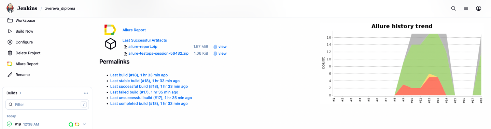

# Spotify Test Automation Project

Comprehensive test automation suite for Spotify application covering Web, API, and Mobile (Android) platforms.

## 📊 Test Coverage

### Web UI Tests (9 tests)
- **E2E Registration Flow** (1 test) - Full user signup process validation ⚠️
- **Registration Form Validations** (8 tests)
  - Email field validation
  - Password strength requirements (minimum length, letters, numbers/special characters)
  - Personal information fields (username, date of birth, gender)
  - Date of birth validation (day, month, year)

### API Tests (5 tests)
- **Track Information Endpoints** (2 tests)
  - Get track details by ID
  - Verify album information and explicit content flags
- **User Playlists & Favorites** (3 tests) ⚠️
  - Create playlist and verify items
  - Add/remove tracks from favorites
  
### Mobile (Android) Tests (3 tests)
- **E2E Registration Flow** (1 test) - Complete signup process on Android ⚠️
- **Registration Validations** (2 tests)
  - Email field requirement
  - Password field requirement


  > ⚠️ *Note: Tests requiring OAuth authentication are skipped in CI due to Spotify's anti-bot protection (reCAPTCHA). These tests pass successfully in local environment.*
  

## 🚀 Tech Stack

- **Python 3.11+** - Programming language
- **Pytest** - Testing framework
- **Selene** - Web UI automation (Selenium wrapper)
- **Appium** - Mobile automation
- **Requests** - API testing
- **Allure** - Test reporting
- **BrowserStack** - Cloud testing infrastructure
- **Poetry** - Dependency management

## ⚙️ Test Execution

### Prerequisites
```bash
# Install dependencies
poetry install
```

### Local Execution
```bash
# Run all tests
pytest tests -v

# Run specific test suites
pytest tests/web -v          # Web UI tests
pytest tests/api -v          # API tests
pytest tests/mobile/android -v  # Mobile tests (requires Appium + Android emulator)
```

### Remote Execution (BrowserStack)
```bash
# Web tests on BrowserStack
WEB_CONTEXT=remote pytest tests/web -v

# Mobile tests on BrowserStack
MOBILE_CONTEXT=remote pytest tests/mobile/android -v
```

## 🔧 Configuration

### Environment Variables
Project uses environment-specific configuration files:
- `.env` - BrowserStack credentials
- `.env.api` - Spotify API credentials
- `.env.mobile.local` - Local Appium settings
- `.env.mobile.bstack` - BrowserStack mobile settings

### Configuration Files
- `config.py` - Web and API settings
- `mobile_config.py` - Mobile test configuration
- `pytest.ini` - Pytest configuration with Allure integration

## 📝 Known Limitations

Some tests are marked as skipped in CI environment due to:
- **Spotify's anti-bot protection (reCAPTCHA)** - Triggers randomly during automated test execution
- **OAuth flow limitations** - Requires interactive browser session not suitable for headless CI

These tests are fully functional in local development environment with visible browser.

---

## 🔗 CI/CD Integration

*[Jenkins Job](https://jenkins.autotests.cloud/job/zvereva_diploma/) is created*


**
