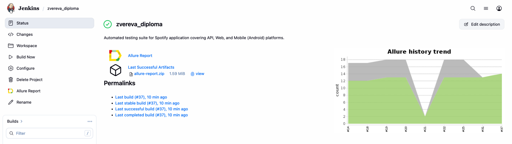
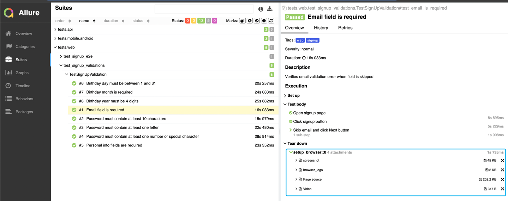
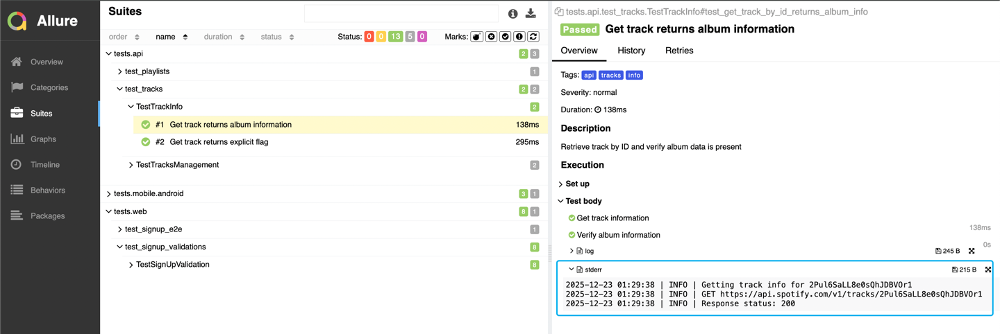
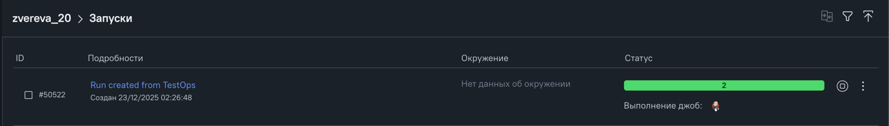

# Spotify Test Automation Project

Comprehensive test automation suite for Spotify application covering Web, API, and Mobile (Android) platforms.

## 📊 Test Coverage

### Web UI Tests (9 tests)
- **E2E Registration Flow** (1 test) - Full user signup process validation ⚠️
- **Registration Form Validations** (8 tests)
  - Email field validation
  - Password strength requirements (minimum length, letters, numbers/special characters)
  - Personal information fields (username, date of birth, gender)
  - Date of birth validation (day, month, year)

### API Tests (5 tests)
- **Track Information Endpoints** (2 tests)
  - Get track details by ID
  - Verify album information and explicit content flags
- **User Playlists & Favorites** (3 tests) ⚠️
  - Create playlist and verify items
  - Add/remove tracks from favorites
  
### Mobile (Android) Tests (3 tests)
- **E2E Registration Flow** (1 test) - Complete signup process on Android ⚠️
- **Registration Validations** (2 tests)
  - Email field requirement
  - Password field requirement


  > ⚠️ *Note: Tests requiring OAuth authentication are marked with `@pytest.mark.ci_skip` and skipped in CI due to Spotify's anti-bot protection (reCAPTCHA). These tests pass successfully in local environment.*
  

## 🚀 Tech Stack

- **Python 3.11+** - Programming language
- **Pytest** - Testing framework
- **Selene** - Web UI automation (Selenium wrapper)
- **Appium** - Mobile automation
- **Requests** - API testing
- **Allure** - Test reporting
- **BrowserStack** - Cloud testing infrastructure
- **Poetry** - Dependency management

## ⚙️ Setup & Configuration

### 1. Install Dependencies
```bash
poetry install
```

### 2. Spotify API Credentials

To obtain Spotify API credentials:
1. Go to [Spotify Developer Dashboard](https://developer.spotify.com/dashboard)
2. Log in with your Spotify account
3. Click **"Create app"**
4. Fill in app details:
   - **App name**: Any name (e.g., "Test Automation")
   - **App description**: Any description
   - **Redirect URI**: `http://example.com/callback` (or `http://127.0.0.1:8888/callback` for local)
   - **API**: Select Web API
5. After creation, you'll see:
   - **Client ID**
   - **Client Secret** (click "Show client secret")
6. - Optional: Create test user accounts and add them to the app in the User Management tab. 
Test Accounts help pass the anti-bot protection to some point.

### 3. Environment Variables

Create the following configuration files in project root:

#### `.env` - BrowserStack credentials
```bash
# BrowserStack
browserstack_username=your_browserstack_username
browserstack_access_key=your_browserstack_access_key
```
#### `.env.api` - Spotify user credentials (for OAuth tests)
```bash
client_id=your_spotify_client_id
client_secret=your_spotify_client_secret

# Test user accounts (add 1-3 accounts for rotation)
user1_name=test_user_1
user1_email=test1@example.com
user1_id=spotify_user_id_1
user1_password=YourPassword123!

user2_name=test_user_2
user2_email=test2@example.com
user2_id=spotify_user_id_2
user2_password=YourPassword456!

callback_url=https://example.com/callback
```
> 💡 **Tip**: User ID can be found in Spotify account settings or by calling `/v1/me` endpoint after authentication.
#### `.env.mobile.local` - Local Appium configuration
```bash
MOBILE_REMOTE_URL=http://127.0.0.1:4723
MOBILE_PLATFORM_VERSION=16
MOBILE_DEVICE_NAME=emulator-5554
MOBILE_APP=apps/spotify.apk
MOBILE_TIMEOUT=20
```

#### `.env.mobile.bstack` - BrowserStack mobile configuration
```bash
MOBILE_REMOTE_URL=https://hub-cloud.browserstack.com/wd/hub
MOBILE_PLATFORM_VERSION=13.0
MOBILE_DEVICE_NAME=Google Pixel 7
MOBILE_APP=bs://your_app_id_here
MOBILE_BSTACK_PROJECT=Spotify_Mobile_Tests
MOBILE_BSTACK_BUILD=Android_Signup
MOBILE_TIMEOUT=20
```

### Configuration Files
- `config.py` - Web and API settings
- `mobile_config.py` - Mobile test configuration
- `pytest.ini` - Pytest configuration with Allure integration

## 📝 Known Limitations

Some tests are marked with `@pytest.mark.ci_skip` in CI environment due to:
- **Spotify's anti-bot protection (reCAPTCHA)** - Triggers randomly during automated test execution
- **OAuth flow limitations** - Requires interactive browser session not suitable for headless CI

These tests are fully functional in local development environment with visible browser.

## 🧪 Test Execution

# Run all tests
pytest tests -v

# Run tests that are excluded from CI
pytest tests -v -m ci_skip

# Run all tests except those excluded from CI (same as Jenkins)
pytest tests -v -m "not ci_skip"


### Generate Allure Report
```bash
# Run tests with Allure
pytest tests -v --alluredir=allure-results

# View report
allure serve allure-results
```
---

## 🔗 CI/CD Integration

*[Jenkins Job](https://jenkins.autotests.cloud/job/zvereva_diploma/) is created*


### Allure Reports in Jenkins

Jenkins test runs generate an Allure report.  
For UI tests, the report includes the following attachments:

- Screenshot
- Browser console logs
- Page source
- Test execution video


For API tests, the report includes the following attachments:
- Logs (console / request-response)


TestOps run is configured:


Telegram notification is sent after the test run completion:


